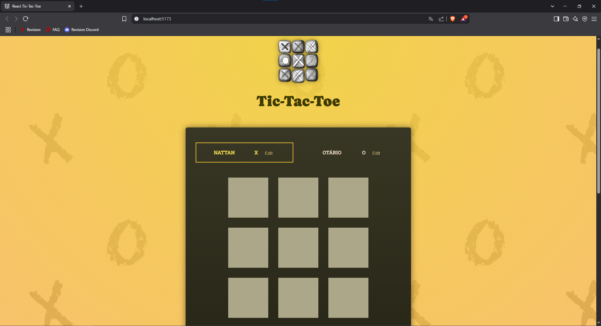

<h1> 

Tic-tac-toe

</h1>

## 🚨 Sobre

**Tic-tac-toe** é um projeto que desenvolvi ao participar do curso de React da udemy no qual me aprodundei em conceitos base do react como rooks, componentes etc
   
## 🔧 Ferramentas

- React
- Vite

  
## 🎯 Link do projeto:
### <a target="_blank" href="https://nattancode07.github.io/projeto-dicovery/">https://nattancode07.github.io/projeto-dicovery/</a>